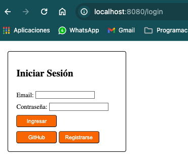
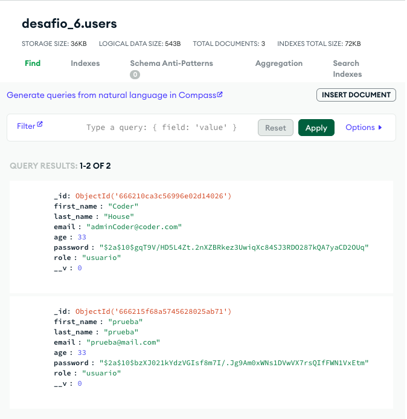
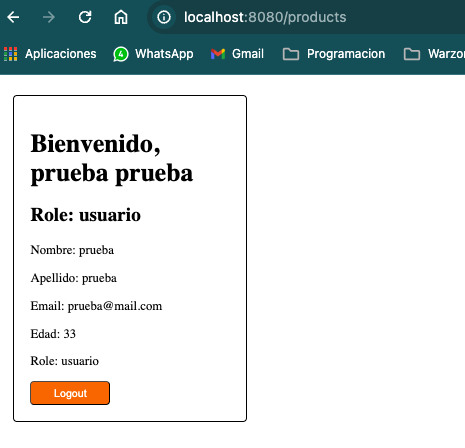
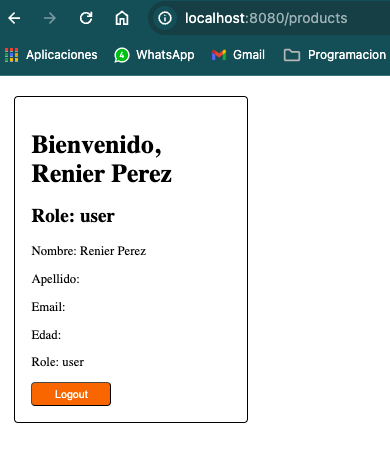
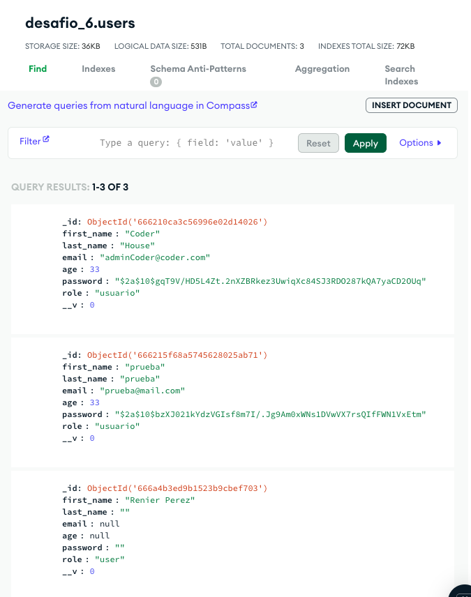
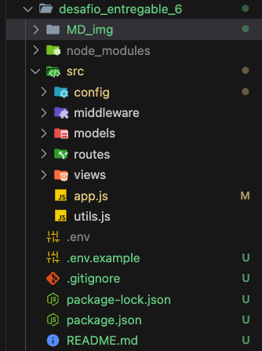
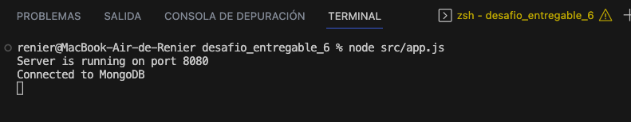

### REFACTORIZACIÓN DEL LOGIN ###
&nbsp;&nbsp;&nbsp;&nbsp;
```` 
En el siguiente desafío refactorizamos el login, la página principal que nos encontramos es la del inicio de sesión, bien sea con email y password o el inicio de sesión mediante GitHub 
`````
&nbsp;&nbsp;&nbsp;&nbsp;

&nbsp;&nbsp;&nbsp;&nbsp;
***
&nbsp;&nbsp;&nbsp;&nbsp;
`````
En la siguiente imagen se ve que solo poseemos dos usuarios creados en nuestra base de datos en mongo 
`````


&nbsp;&nbsp;&nbsp;&nbsp;
***
&nbsp;&nbsp;&nbsp;&nbsp;
`````
En la siguiente imagen vemos una prueba logeado con el usuario "prueba" que tenemos registrado en nuestra base de datos en Mongo
`````
&nbsp;&nbsp;&nbsp;&nbsp;

&nbsp;&nbsp;&nbsp;&nbsp;
***
&nbsp;&nbsp;&nbsp;&nbsp;
`````
Siguiente adjunto la imagen del login usando el boton de GitHub y los datos
que nos muestra
`````
&nbsp;&nbsp;&nbsp;&nbsp;

&nbsp;&nbsp;&nbsp;&nbsp;
***
&nbsp;&nbsp;&nbsp;&nbsp;
````
Ahora mostramos la imagen con los datos de usuarios de la base de datos ya que al ingresar con GitHub nos crea un nuevo usuario
````
&nbsp;&nbsp;&nbsp;&nbsp;



&nbsp;&nbsp;&nbsp;&nbsp;
***
&nbsp;&nbsp;&nbsp;&nbsp;
````
Muestro el árbol de rutas de carpeta luego de hacer las modificaciones sugeridas agregando node_modules y package.json propio a la carpeta desafop_entregable_6
````
&nbsp;&nbsp;&nbsp;&nbsp;


&nbsp;&nbsp;&nbsp;&nbsp;
***
&nbsp;&nbsp;&nbsp;&nbsp;
````
Por último muestro la consola corriendo efectivamente en desafio_entregable_6 % node src/app.js
````
&nbsp;&nbsp;&nbsp;&nbsp;



